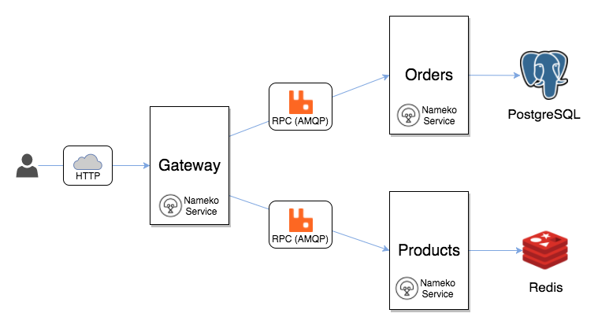

# Practica Final - Integración Contínua

- [Desatranques Jaén](#desatranques-jaén)
  * [La aplicación](#la-aplicación)
    + [Arquitectura](#arquitectura)
    + [Estructura del repositorio](#estructura-del-repositorio)
      - [Servicio _Products_ :file_folder:](#servicio--products---file-folder-)
      - [Servicio _Orders_ :file_folder:](#servicio--orders---file-folder-)
      - [Servicio _Gateway_ :file_folder:](#servicio--gateway---file-folder-)
  * [Entorno de desarrollo local](#entorno-de-desarrollo-local)
      - [Crear Producto](#crear-producto)
      - [Consultar Producto](#consultar-producto)
      - [Crear Pedido](#crear-pedido)
      - [Consultar Pedido](#consultar-pedido)
    + [Tests](#tests)
      - [Unitarios](#unitarios)
      - [Smoke tests](#smoke-tests)
      - [Ejecución](#ejecuci-n)
    + [Flujo de desarrollo](#flujo-de-desarrollo)
- [Desarrollo de la práctica](#desarrollo-de-la-práctica)
  * [1. Pipeline básico](#1-pipeline-básico)
  * [2. Pipeline paralelo](#2-pipeline-paralelo)
  * [3. Pipeline dinámico](#3-pipeline-dinámico)
  * [Opcional - Añadiendo información](#opcional-añadiendo-información)
  * [Opcional - Multi CI](#opcional-multi-ci)
  * [Opcional - Smoke tests](#opcional-smoke-tests)
  * [:information_source: Creación de ramas](#information_source-creación-de-ramas)
- [Entrega](#entrega)


## Desatranques Jaén


Enhorabuena, has sido elegido para formar parte del equipo de desarrollo de la empresa de moda en las [redes sociales](https://twitter.com/desatranquejaen?lang=es)! 

Concretamente, te vas a unir al equipo que desarrolla la tienda online, **Desatranques Jaén Store**. Tu cometido es desarrollar un pipeline que garantice la calidad del software entregado y mejore su proceso de entrega de valor.

## La aplicación

El equipo de tienda tiene algunos componentes ya desarrollados, y han optado por una arquitectura de microservicios mediante un framework en Python llamado [Nameko](https://github.com/nameko/nameko).

Actualmente han desarrollado la parte de _backend_, mediante una API que será consumida por el _frontend_ y otros servicios.

### Arquitectura




### Estructura del repositorio

El código de los microservicios se encuentra alojado en el mismo repositorio, lo que se conoce como **monorepo**. Esto presenta una serie de desafíos a la hora de desarrollar pipelines eficientes a los que tendrás que enfrentarte.

Tenemos 3 servicios basados en Nameko: `Products`, `Orders` y `Gateway`, además de servicios de infraestructura para comunicación y persistencia. 

---
:warning: Los monorepos no son necesariamente una buena práctica.

---

#### Servicio _Products_ :file_folder:

Responsable de almacenar y gestionar la información de productos, expone una interfaz RPC (_Remote Procedure Call_) que puede ser consumida por otros servicios. Internamente, este servicio utiliza Redis para almacenar datos.

#### Servicio _Orders_ :file_folder:

Responsable de almacenar y gestionar la información de los pedidos, expone una interfaz RPC que puede ser consumida por otros servicios. Internamente, este servicio utiliza una base de datos PostgreSQL para persistir la información de los pedidos. 

#### Servicio _Gateway_ :file_folder:

Este servicio expone una interfaz HTTP para ser usada por clientes externos, como aplicaciones web o móviles. Coordina las peticiones entrantes y compone las respuestas basados en los datos de los servicios de backend.


## Entorno de desarrollo local

El entorno de desarrollo se encuentra _dockerizado_, lo que simplifica bastante nuestro trabajo. 

Las imágenes Docker de [RabbitMQ](https://hub.docker.com/_/rabbitmq/), [PostgreSQL](https://hub.docker.com/_/postgres/) and [Redis](https://hub.docker.com/_/redis/) se descargan automáticamente, mientras que los microservicios se construyen en el momento. De esta manera se crea una red común donde todos los componentes se comunican por nombre.

Todos los microservicios heredan de una [imagen base](./Dockerfile) que debe ser construida previamente mediante:

```
docker build --target base -t desatranques/base .
```

Para desarrollar los microservicios y probar el funcionamiento de manera interactiva, se incluye un fichero Docker Compose que puedes utilizar mediante:

```
docker-compose up --build
```

La aplicacion **tarda un tiempo** en arrancar. Se tienen que levantar todos los servicios, siendo RabbitMQ el más pesado. Los microservicios tratan de conectar repetidamente hasta que RabbitMQ empieza a aceptar peticiones. En ese momento verás el log `Connected to amqp:...`, lo que significa que el servicio está en funcionamiento y listo para usarse.


---
:warning: RabbitMQ es un servicio muy dependiente de la velocidad de CPU. Si experimentas latencia al hacer las peticiones, deberías utilizar un ordenador más potente.

---

Para hacer las pruebas interactivas, atacaremos al servicio HTTP que levanta el servicio _Gateway_. En el fichero Docker Compose puedes ver que se publica el puerto 8003. Disponemos de los siguientes endpoints.


#### Crear Producto

```sh
curl -XPOST http://localhost:8003/products -d @- << EOF
{
  "id": "shit_vacuum_2000",
  "title": "Shit Vacuum 2000",
  "width": 101,
  "flow_capacity": 5,
  "in_stock": 10
} 
EOF
```

#### Consultar Producto

```sh
curl 'http://localhost:8003/products/shit_vacuum_2000'

{
  "id": "shit_vacuum_2000",
  "title": "Shit Vacuum 2000",
  "width": 101,
  "flow_capacity": 5,
  "in_stock": 10
}
```
#### Crear Pedido

```sh
curl -XPOST http://localhost:8003/orders -d @- << EOF 
{
  "order_details": [
    {
      "product_id": "shit_vacuum_2000",
      "price": "100000.99",
      "quantity": 1
    }
  ]
}
EOF

{"id": 1}
```

#### Consultar Pedido

```sh
$ curl 'http://localhost:8003/orders/1'

{
  "id": 1,
  "order_details": [
    {
      "id": 1,
      "quantity": 1,
      "product_id": "shit_vacuum_2000",
      "image": "http://www.example.com/desatranques/images/shit_vacuum_2000.jpg",
      "price": "100000.99",
      "product": {
        "flow_capacity": 5,
        "id": "shit_vacuum_2000",
        "title": "Shit Vacuum 2000",
        "width": 101,
        "in_stock": 9
      }
    }
  ]
}
```

### Tests

El equipo de desarrollo ha hecho un gran trabajo y ya cuenta con tests automatizados y _dockerizados_ para los diferentes microservicios.

#### Unitarios

La especificación de los tests unitarios se encuentra en la carpeta `/test`y utiliza el framework _pytest_.

La única pega es que requieren que los servicios de RabbitMQ y Redis estén en ejecución, accesibles mediante los nombres de host `rabbit` y `redis` respectivamente.

#### Smoke tests

También se incluyen _smoke tests_, que prueban la funcionalidad básica de las APIs mediante la herramienta [Tavern](https://github.com/taverntesting/tavern). Los tests se especifican mediante un fichero YAML, indicando las peticiones que se quieren a realizar y las respuestas que se esperan, siendo el _framework_ el encargado de ejecutar y validar las peticiones.

---
:warning: Estos tests no son idempotentes, generan productos y pedidos, pero no los eliminan, así que tienen que ejecutarse en **entornos limpios**.

---

#### Ejecución

La ejecución de los tests está también _dockerizada_. Mediante un fichero `docker-compose.yml` adicional se añade un nuevo contenedor encargado de ejecutar los tests contra en entorno de desarrollo. Éste simplemente cuenta con las dependencias necesarias para ejecutar los tests, incluidas en `test-requirements.txt`, y con un script que lanza los scripts unitarios y el smoke test.

Podeis probarlo mediante:

```
docker-compose -f docker-compose.yml -f test/docker-compose.yml build
docker-compose -f docker-compose.yml -f test/docker-compose.yml run tester
```

---
:warning: Aseguraos de limpiar el entorno local una vez ejecutados los test con `docker-compose -f docker-compose.yml -f test/docker-compose.yml down` antes de volverlos a ejecutar

---
### Flujo de desarrollo

El equipo de desarrollo tiene acordado la siguiente estrategia de git:

- La rama `master` es una rama protegida y no se pueden hacer cambios directamente bajo ninguna circunstancia.
- La rama `master` mantiene el código listo para publicar/desplegar o recién publicado/desplegado.
- Se utilizan ramas `feature/` para el desarrollo de nuevas funcionalidades o corrección de bugs no críticos.
- Las ramas `feature/` parten de `master`.
- Las ramas `feature/` se mergean en `master` y se borran inmediatamente.
- Cuando se mergean cambios en `master` se considera que están listos para publicar/desplegar inmediatamente.
- Para publicar/desplegar, se genera una rama `release/`. Los desarrolladores son los encargados de definir la versión en el momento de crear la rama, por ejemplo, `release/0.0.1`. Se sigue versionado semántico.
- Para simplicar la práctica, **no se taguearán** las versiones mediante git.
- Las ramas `release/` tienen un ciclo de vida indefinido, no se borran.
- En caso de necesitar un _hotfix_, correción de un bug crítico en producción, se generará una rama `feature/` a partir de la rama `master/`, y se corregirá el fallo directamente en esa rama. Esto es posible porque nuestra rama `master`, según el acuerdo, contendrá el código de producción. Cuando se corrija el cambio, se mergea en `master` y se saca rama `release/` increntando el último dígito de la versión de la rama `release/` afectada, que será la última. Por ejemplo, se detecta un error crítico en `release/0.1.0`, se genera rama `feature/fix` de `master`, se corrige, se llevan los cambios a `master` y se saca `release/0.1.1`. 


# Desarrollo de la práctica

Los únicos requisitos que impone el equipo de desarrollo son los siguientes:

- Las ramas `release/` generan una version entregable de **todos los artefactos** con la version especificada en la rama. Por ejemplo, la rama `release/2.3.1` debe generar los artefactos `orders:2.3.1`, `gateway:2.3.1` y `products:2.3.1`
- Los artefactos deben almacenarse en el repositorio Nexus
- Los test unitarios deben pasarse en `feature/`, `master` y `release/` de manera automática.

Por otro lado, nuestra experiencia nos indica que además deberíamos tener en cuenta:
- Eficiencia en términos de tiempo de ejecución
- Facilidad de mantenimiento del pipeline
- Reproducibilidad del pipeline de manera local
- Construcción de artefactos una única vez
- Evitar repetir código (principio DRY: Don't Repeat Yourself)
- Intentar simplificar cuando sea posible (principio KISS: Keep It Simple Stupid)

Éstos serán los criterios de evaluación.

## 1. Pipeline básico

Desarrollar un pipeline **secuencial** en el servidor CI de tu elección (GitLab CI o Jenkins) que genere, pruebe y publique los artefactos según el comportamiento especificado. Para ello se utilizará la infraestructura que se ha desarrollado durante este módulo.

Cómo *mínimo* contará con las siguientes etapas:
- Build - Construcción de las imágenes Docker
- Test - Ejecución de los test **unitarios**
- Publish - Tagueo de las imágenes y almacenamiento en Nexus

pero puedes añadir las etapas que consideres necesarias. Es posible que tengas que modificar los `Dockerfile`.

La **fase de test es la más complicada**, selecciona el servidor de CI que creas que puede resolver mejor ese escenario. En cualquier caso, si te atascas estoy a tu disposición para resolver dudas.

## 2. Pipeline paralelo

Mejora el pipeline anterior paralelizando todos los pasos que puedas. ¡No olvides utilizar varios nodos ejecutores en lugar de uno!

## 3. Pipeline dinámico

¿Es necesario que ejecutemos todos los pasos cuando sólo estamos cambiando el microservicio de pedidos? Diseña un pipeline que ejecute solo los pasos indispensables para el conjunto de cambios que hay en la rama. Por ejemplo, si modificamos el _gateway_, únicamente hay que construir, probar y publicar el _gateway_.

Necesitarás utilizar:
- En GitLab CI la directiva[ `changes`](https://docs.gitlab.com/ee/ci/yaml/#onlychangesexceptchanges)
- En Jenkins la directiva[ `changeset`](https://jenkins.io/doc/book/pipeline/syntax/#when)

Y cuidado con las dependencias entre imágenes.

----
<details>
<summary><strong>Tareas opcionales (Click para expandir)</strong></summary><p>

## Opcional - Añadiendo información

Añade reportes de test y cobertura al pipeline en formato Junit y [Cobertura](https://wiki.jenkins.io/display/JENKINS/Cobertura+Plugin).

- Necesitarás buscar en la documentación, y quizá añadir algún plugin a tu plataforma de CI
- Los reportes deben estar consolidados. Si se prueban los 3 microservicios, debemos tener los resultados de los 3.

## Opcional - Multi CI

Desarrolla el pipeline en el la otra plataforma de CI. Esto te permitirá experimentar de primera mano las diferencias entre un sistema y otro.


## Opcional - Smoke tests

Ejecuta los smoke tests en las ramas `master` y `release`.

</details>

----

## :information_source: Creación de ramas

Se incluye un fichero `feature.patch` que añade una operación a la API de productos. Puedes aplicarlo en una rama `feature` para comprobar como afecta a los tests o su cobertura. Para aplicarlo basta con que ejecutes

```
git apply feature.patch
```
en tu rama `feature`.

Esta operación habilita listar los productos disponibles:

```sh
$ curl 'http://localhost:8003/products/'
```


# Entrega

- Debeis enviarme un link a vuestro repositorio y darme permisos de _Maintainer_. 
- El repositorio debe contener una rama `master`, una rama `feature` y una rama `release`.
- Los pipelines de las diferentes ramas deben ser exitosos.
- Una explicación breve de los motivos por los que habeis seleccionado un herramienta u otra.
- Detallar cambios en la configuración o plugins en cada herramienta de CI, si aplica

Buena suerte! :+1:
